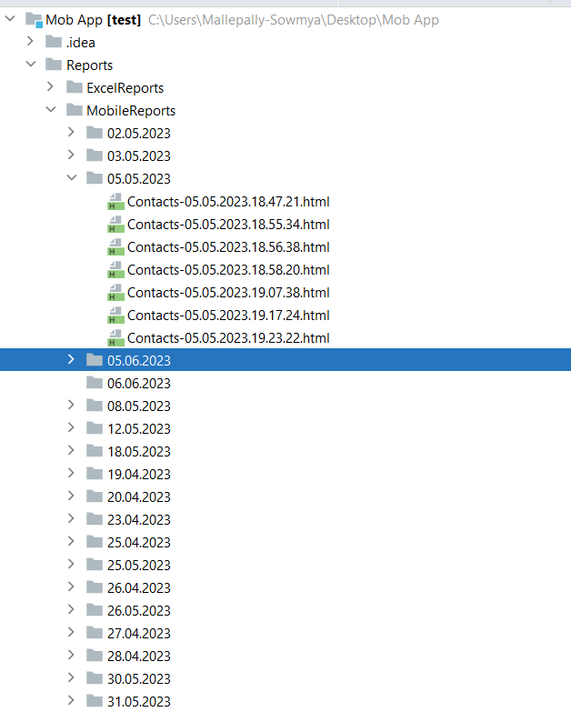

# **Mobile Automation Framework**
==================================
> Using Appium to Automate UI Testing of Android and iOS Contacts Application with Java
> Basically you need to have appium installed

## **Tools & libraries**
------------------------
This Mobile automation framework comprised of following tools and libraries
* selenium-java : 4.8.3
* TestNG : 7.7.1
* Maven : 3.11.0
* Appium : 8.3.0
* Apache POI : 5.2.3
* Extent Report : 5.0.9
* Lombok: - Java utility api
* Intellij: - Integrated Development Environment

## **IDE Configuration**
------------------------
### **Intellij plugins**
Configure and Install Following Plugins  
File >> Setting >> Plugins >> Browser Repositories>
* lombok
* Git Integration  
* Maven Integration
* TestNg  
* Git Integration

**Compile Build or Run Tests**
------------------------------
Go to folder path which is located in project-> mvn test
## Command Line
To clean and compile the build
-----------------------------
> mvn clean install

To run default Test suite based on the multiple tags
--------------------------------------- 
> mvn clean test ="@Test"
# **suites level Execution**
----------------------------
> Run from maven :
> mvn clean test -DsuiteXmlFile=Android_Suite_MultipleDevices_BS.xml
> mvn clean test -DsuiteXmlFile=Android_Suite_SingleDevices_BS.xml
> mvn clean test -DsuiteXmlFile=Android_Suite_SingleDevice.xml // For real device use this command

## **Use browser stack from CLI**
---------------------------------
> mvn clean test -Dsuite="YOUR_BS_SUITE_FILE.xml" -Dbrowserstack = true

> _Note_: If you are not passing CLI option -Dbrowserstack then it will pick by default from the config > browserstack

## **Running the tests on local device :**
------------------------------------------
> To run your tests on local simply you need to execute the following xml file
Android_Suite_SingleDevice.xml

> Running the tests on browser stack for single device :

> _Update:_ "browserstack" parameter value in config.properties and set as "true".

> To run your tests on browser stack simply you need to execute the following xml file
Android_Suite_SingleDevice_BS.xml

## **Running the tests on browser stack for multiple device :**
---------------------------------------------------------------
> Update "browserstack" parameter value in config.properties and set as "true".
To run your tests on browser stack simply you need to execute the following xml file
Android_Suite_MultipleDevices_BS.xml

## **Locators :**

> Added locators in .json file under resources > Locators directory

## **Page Object Model :**

> Added pages under src > test > java > com > qm > android > screens package
>
> Added tests under src > test > java > com > qm > android > testcases package
>
> Added application level common classes and helper classes under src > test > java > com > qm > android > utils package
>
> Added listeners under src > test > java > com > qm > listeners package
> 
> Added framework level common classes and helper classes under src > test > java > com > qm > utilities package
> 
> Added CongigFiles, Locators, Test Suits under src > test > resources

**> Report**
=============================================
- Extent Reports can be found in Reports directory separated by date
  
